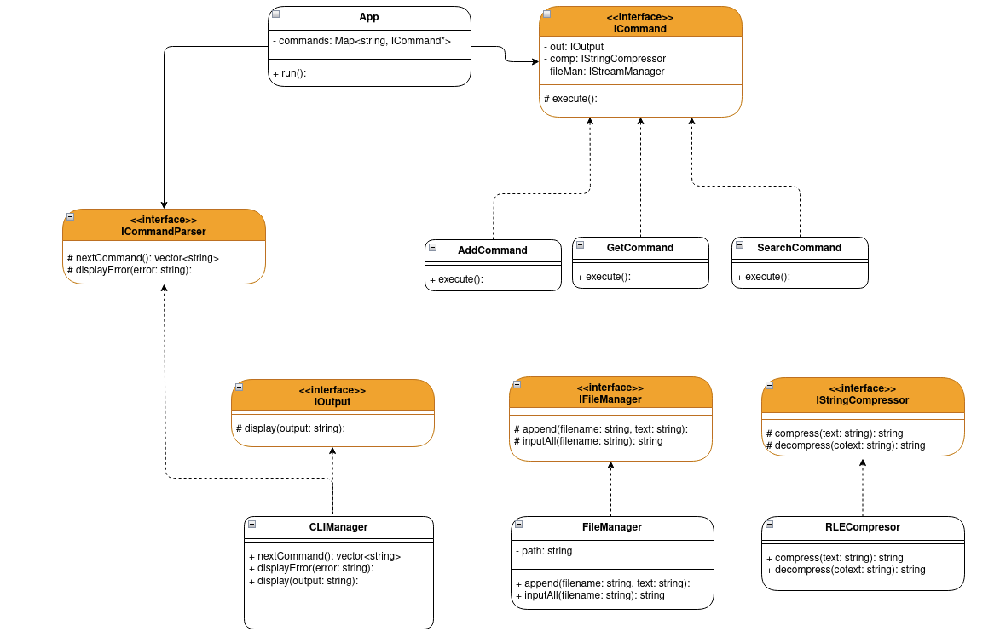

# AdvanceProg-Part1
This is the first stage of a building a working drive for the course "Advanced Programming".  
In this part, we'll implement a CLI interface that accept these 3 commands:  
1. `add [file name] [text]` - will add a new file.
2. `get [file name]` - will display the content of the file.
2. `search [file content]` - will display all the names of the files containing 'file content'.  
## The structure of our project
We planned the structure of the project such that it will be **closed for modification** and **open for expension**. Thus, we have build the following structure presented in UML:  
